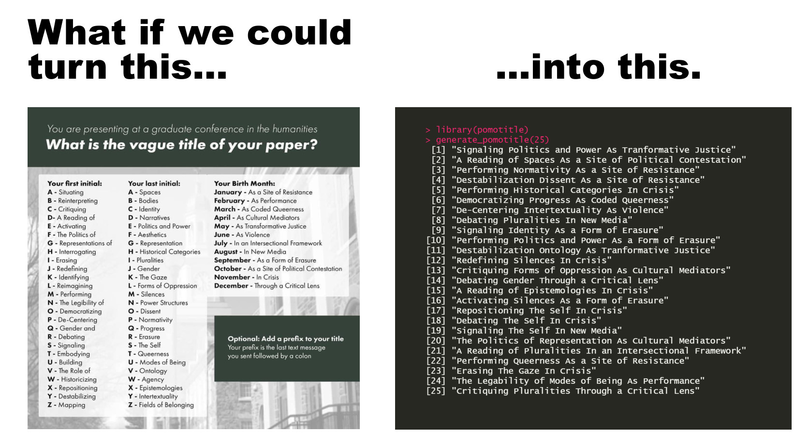

# pomotitle: The Postmodernist Title Generator in R



Why do we need a postmodern title generator in R?

Because we must situate erasure as a form of ontological pluralistic framework.

## Install

```r
# install.packages("devtools")

devtools::install_github("peterdalle/pomotitle")
```

## Usage

```r
library(pomotitle)

generate_pomotitle(3)
```

```
[1] "Reimagining Spaces As a Site of Resistance"
[2] "Embodying Pluralities In Crisis"           
[3] "Representations of Progress As Performance"
```

Or use `generate_pomotitle()` to give you only one title.

## License

[MIT](LICENSE)
